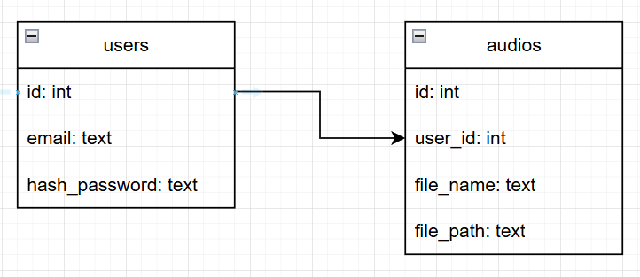

# Проект «Загрузчик аудио-файлов»
___

## Функциональные возможности
___
Данный сервис имеет следующие вункциональыне возможности:
- Авторизация пользователей через Яндекс
- Авторизация пользователей с помощью email и пароля
- Загрузка аудио-файлов локально
- Просмотр данных под суперпользователем

## Компоненты сервиса
___
Сервис состоит из следующих компонентов
- Сервис для регистрации пользователей
- Загрузчик аудио-файлов
- OAuth Яндекс
- PostgreSQL

___
## База данных схема
 

Схема базы данных(PostgreSQL) audios содержит 2 таблицы
* Таблица users - содержит поля id, email, hash_password
* Таблица audios - включает в себя поля id, user_id, file_name, file_path

связь между таблицами one-to-many (users.id -> audios.user_id)

## Как запустить
___
### Инструкция
1. В корневом каталоге проекта создать файл .env со структурой, описанной в соответствующем разделе.
2. запустить команду `docker-compose up --build`
3. Перейти на страницу http://localhost:9000/docs
4. Остановка сервера `docker-compose down`
5. Запуск `docker-compose up -d`

## Файл конфигурации
___
Перейдите на сайт https://oauth.yandex.ru/ создайте приложение следуя инструкции, выберите веб-сервисы -> выберите доступ к **почте и логину**
-> далее в строке Redirect URI подставьте `https://oauth.yandex.ru/verification_code`, в строке Suggest Hostname ничего не надо ->
почта для связи и сохранить

В появившемся приложении надо перенести в .env следующие данные: ClientID, Client secret, Redirect URI для веб-сервисов
___
```
# DB
DB_DRIVER=postgresql
DB_HOST=postgres
DB_PORT=5432
DB_USERNAME=postgres
DB_PASSWORD=postgres
DB_NAME=postgres

# OAuth Яндекс
YANDEX_CLIENT_ID= Введите ClientID
YANDEX_CLIENT_SECRET= Введите Client secret
YANDEX_REDIRECT_URI= Redirect URI для веб-сервисов

# JWT
JWT_SECRET_KEY=secretkey3645@@q1vchg
JWT_ALGORITHM=HS256

# Docker
BACKEND_HOST=0.0.0.0
BACKEND_PORT=8000
```

## Стек технологий
---
- Python 3.13
- FastAPI
- Pydantic
- OAuth
- Docker
- SQLAlchemy
- PostgreSQL
